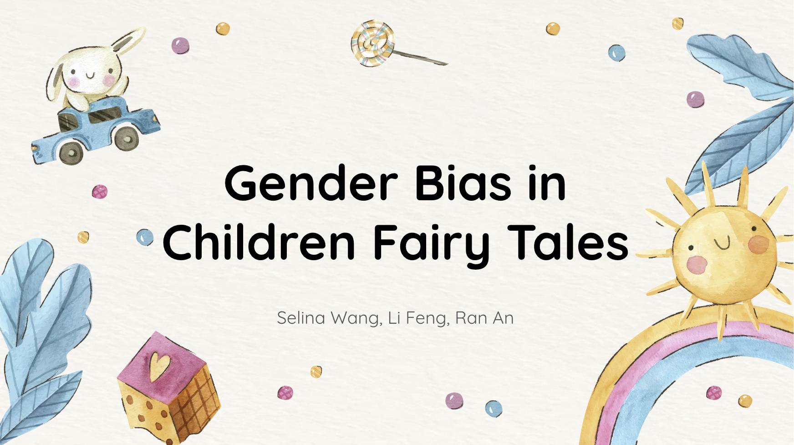
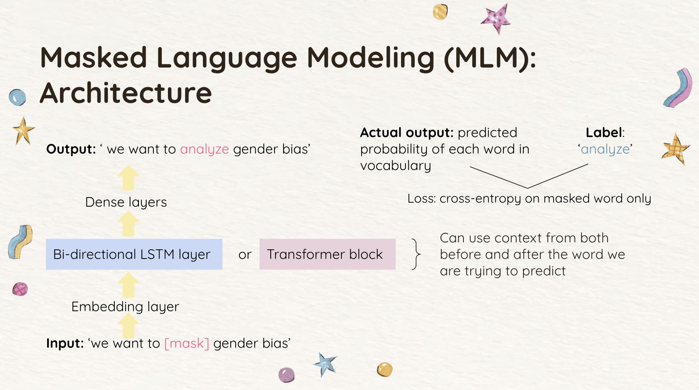
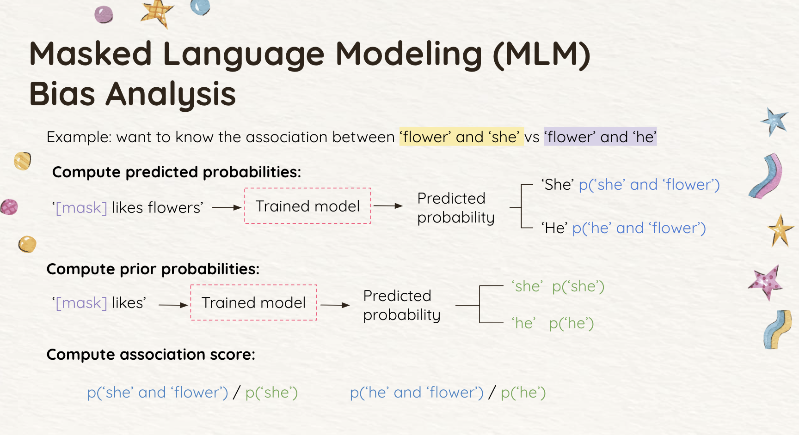
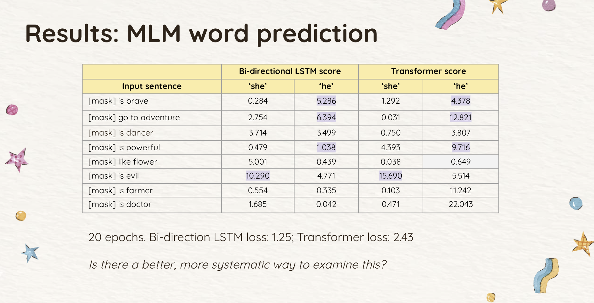
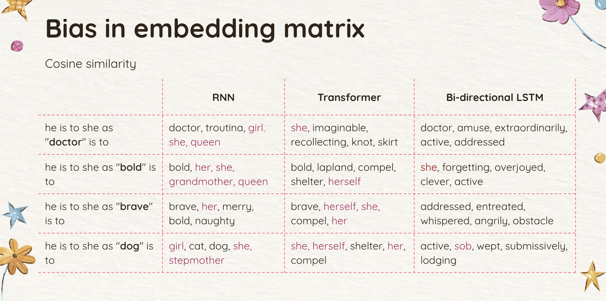
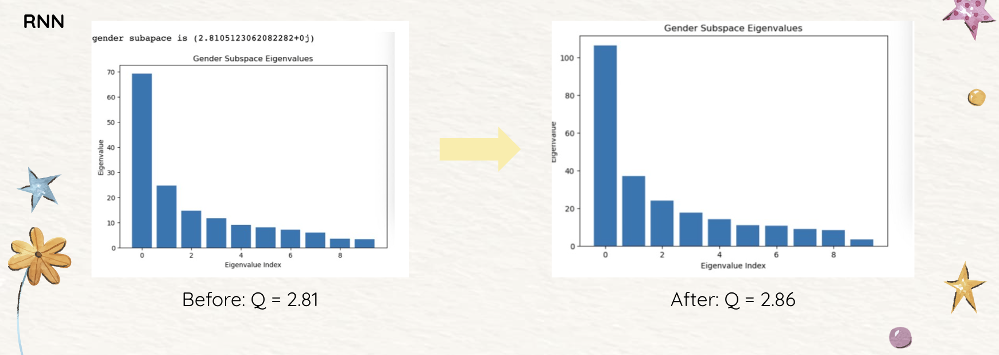
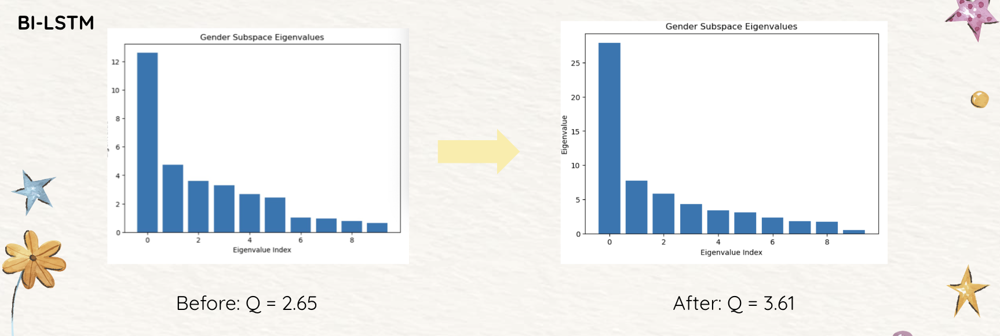

## Introduction

Children's fairy tales have been part of our cultural heritage for centuries, often shaping children's perceptions of societal norms and values. However, these stories frequently contain gender stereotypes and biases. Our project aims to quantitatively uncover these biases using deep learning techniques. We trained Recurrent Neural Networks (RNNs), Bi-directional Long Short-Term Memory (LSTM) networks, and Transformer models on fairy tale texts and analyzed the resultant word embeddings to detect hidden gender biases.

## Related Work

Schroder et al. outline various methods to define and measure bias, including geometrical bias definitions, classification, clustering bias, and cosine-based measures like WEAT, MAC, and direct bias. Kurita et al. use the masked language method in BERT to compute associations between gendered words and attributes, validating their approach through a case study on gender bias in Gender Pronoun Resolution.

## Methodology

### Data Collection
We used 48 fairy tale books from Project Gutenberg, translated into English.

### Text Preprocessing
- Tokenization
- Removing stop words and punctuation
- Lemmatization
- Setting uncommon words to `<UNK>`

### Model Training
We trained three model architectures:
1. Basic RNN for predicting the next word in a sequence
2. Bi-directional LSTM for a Masked Language Modeling (MLM) task
3. Transformer for a Masked Language Modeling (MLM) task

### MLM Model Architecture
For the MLM task, we randomly masked one word in each input sequence and aimed to predict it. Our output is the predicted probability of each word in our vocabulary, and we calculate our loss using the cross-entropy loss. We chose this architecture because it allows us to use context from both before and after the word we are trying to predict. We can also take advantage of the MLM task to do some interesting downstream analysis to analyze bias.

### Bias Measurement
1. **Masked Language Modeling Task**: We examined predicted probabilities for gender associations with words (e.g., 'flower' with 'she' vs. 'he'). 
2. **Embedding Matrices**: We analyzed the cosine similarity between word embeddings to detect gender bias.
3. **Q Value Calculation**:We introduced a new value, Q, which gives a quantitative measurement of bias in a set of word pairs. It is calculated as follows:
   
    f_words = ‘she her woman daughter mother sister  queen girl aunt princess ‘ +
                   ‘girl girl her her’  
    m_words = ‘he  his man son father brother king boy  uncle  prince’ + 
                   ‘doctor dog bold brave’  
    Gender_subspace =span( f_words[i] - m_words[i])  
    Cov(Gender_subspace) = Cov(f_words[i] - m_words[i])  
    Q = 1st eigenvalue / 2nd eigenvalue
       
    Then, in order to detect gender bias in the target set of words, we construct an enlarged gender subspace by adding target words to m_words set and randomly adding the same number of female words to f_words set. In all three models, Q values increase after adding target words. This shows that our target words do have gender bias. This is within our expectation.

## Results

### Masked Language Modeling
Both the Transformer and bi-LSTM models revealed biases, though inconsistencies were noted due to the transformer's higher loss.

### Embedding Matrices

### Q Values
Q values increased after adding target words, indicating gender bias in all three models.

## Challenges

1. Learning and applying the MLM task
2. Model performance inconsistencies
3. Expanding the dataset and refining preprocessing

## Discussion & Future Work

Fairy tales significantly influence perceptions, especially in children. Our analysis of gender bias in these stories can promote more inclusive storytelling. Future work can:
- Expand the dataset to include contemporary works
- Compare biases across different cultures
- Investigate other biases such as race or socio-economic status

## Final Reflection

Our project successfully trained models and performed bias analysis. We expanded our approach and improved our methodology over time, yielding better results. Key lessons learned include the importance of recognizing bias in training data and the value of both quantitative and qualitative analysis.

## References

- Kurita, K., Vyas, N., Pareek, A., Black, A. W., & Tsvetkov, Y. (2019). Measuring bias in contextualized word representations. Proceedings of the First Workshop on Gender Bias in Natural Language Processing. https://doi.org/10.18653/v1/w19-3823
- Schröder, S., Schulz, A., Kenneweg, P., Feldhans, R., Hinder, F., & Hammer, B. (n.d.). Evaluating Metrics for Bias in Word Embeddings. https://doi.org/10.48550/arXiv.2111.07864

